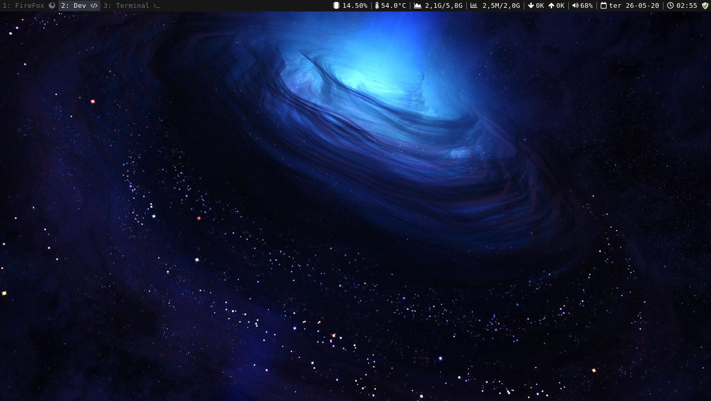

# i3wm-config

<h1 align="center">
    
</h1>

### `Pacotes necessários`
- i3wm 
- i3blocks
- i3lock
- suckless-tools
- rofi
- feh (esse pacote é só para por o wallpaper mas se não quiser wallpaper não precisa baixá-lo).
- imagemagick (utilizaremos deste pacote o `import` para captura de tela).
- sysstat (utilizaremos deste pacote o `mpstat` para que o bloco do `cpu_usage` funcione).

### `Organizando as pastas para funcionar as configurações`

Mova as pastas `i3`,`i3status`,`rofi` para a pasta `/home/seu_usuário/.config`.

### `Temas para o rofi`

Mova os arquivos `breeze-dark.rasi` e `breeze-dracula.rasi` como `root` para a pasta `/usr/share/rofi/themes`,
os temas foram pegos nesse [repositório](https://github.com/MonsieurBedard/rofi-breeze-theme).

### `Utlizando as fontes`

Para utilizar as fontes mova o arquivo `.fonts` para sua `/home`, os ícones foram pegos [aqui](https://fontawesome.com/cheatsheet/free/solid), utilize ctrl+f para pesquisa-los.
